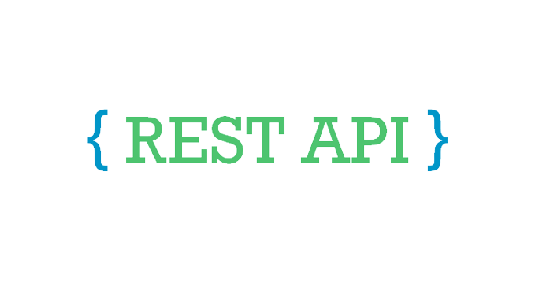
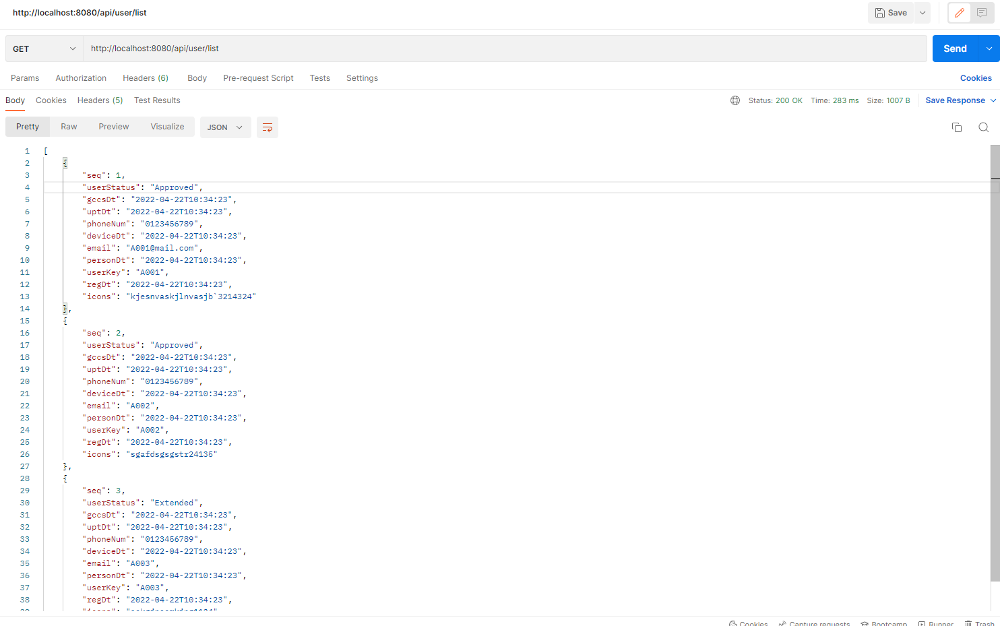

# rest-api-with-local-database
## REST API using Spring Boot and Java

[LinkedIn](https://www.linkedin.com/in/aazamuddin4/)

<!-- PROJECT LOGO -->
<br />
<p align="center">
  <a href="https://github.com/aazamuddin4/rest-api-with-local-database">
    
  </a>

  <h3 align="center">REST API using Spring Boot</h3>

  <p align="center">
    This Project: REST API framework designed for website interface and retrieving data from MySQL Database
    <br />
    <a href="https://github.com/aazamuddin4/rest-api-with-local-database"><strong>Explore the docs »</strong></a>
    <br />
    <br />
    <a href="https://github.com/aazamuddin4/rest-api-with-local-database">View Demo</a>
    ·
    <a href="https://github.com/aazamuddin4/rest-api-with-local-database">Report Bug</a>
    ·
    <a href="https://github.com/aazamuddin4/rest-api-with-local-database">Request Feature</a>
  </p>
</p>


<!-- TABLE OF CONTENTS -->
<details open="open">
  <summary><h2 style="display: inline-block">Table of Contents</h2></summary>
  <ol>
    <li>
      <a href="#about-the-project">About The Project</a>
      <ul>
        <li><a href="#built-with">Built With</a></li>
      </ul>
    </li>
    <li>
      <a href="#getting-started">Getting Started</a>
      <ul>
        <li><a href="#prerequisites">Prerequisites</a></li>
        <li><a href="#installation">Installation</a></li>
      </ul>
    </li>
    <li><a href="#purpose">Purpose</a></li>
    <li><a href="#roadmap">Roadmap</a></li>
    <li><a href="#contributing">Contributing</a></li>
    <li><a href="#contact">Contact</a></li>
  </ol>
</details>


<!-- ABOUT THE PROJECT -->
## About The Project

<a>
    
  </a>

### Built With

* [x] Eclipse IDE for Eclipse Committers
* [x] Spring Boot 
* [x] MySQL Workbench
* [x] MySQL Installer
* [x] Postman


<!-- GETTING STARTED -->
## Getting Started

To get a local copy up and running follow these simple steps.

### Prerequisites

* an IDE or a text editor
* JDK 1.8+
* Maven 3+

### Installation

1. Clone the repo
   ```sh
   git clone https://github.com/aazamuddin4/rest-api-with-local-database.git
   ```
2. Install Eclipse IDE for Eclipse Committers
3. Initializing a Spring Boot Project
   ```sh
   Go to start.spring.io and add below dependencies
   ```
   * [x] Spring Data JPA
   * [x] Spring Web
   * [x] Spring Boot DevTools
   * [x] MySQL Driver
  
   Once installed, open the maven project in Eclipse IDE
4. Install MySQL Installer with added product of
   * [x] MySQL Server
   * [x] MySQL Workbench
   * [x] Connector/ODBC
5. Install MySQL Workbench GUI
   ```sh
   Create connection between the server created in the MySQL Installer
   ```
6. Install Postman
   ```sh
   Test the URL created in the APIcontroller.java (GET or POST)
   ```

<!-- USAGE EXAMPLES -->
## Purpose

Application programming interface (API or web API) that conforms to the constraints of REST architectural style and allows for interaction with RESTful web services. REST stands for representational state transfer

<!-- ROADMAP -->
## Roadmap

See the [open issues](https://github.com/aazamuddin4/rest-api-with-local-database/issues) for a list of proposed features (and known issues).


<!-- CONTRIBUTING -->
## Contributing

Contributions are what make the open source community such an amazing place to be learn, inspire, and create. Any contributions you make are **greatly appreciated**.

1. Fork the Project
2. Create your Feature Branch (`git checkout -b feature/AmazingFeature`)
3. Commit your Changes (`git commit -m 'Add some AmazingFeature'`)
4. Push to the Branch (`git push origin feature/AmazingFeature`)
5. Open a Pull Request


<!-- CONTACT -->
## Contact

Email - andiazamuddin@gmail.com

Twitter - [@aaxamuddin](https://twitter.com/aaxamuddin)

LinkedIn Link: [https://www.linkedin.com/in/aazamuddin4/](https://www.linkedin.com/in/aazamuddin4/)

<!-- MARKDOWN LINKS & IMAGES -->
<!-- https://www.markdownguide.org/basic-syntax/#reference-style-links -->
[linkedin-url]: https://www.linkedin.com/in/aazamuddin4/
